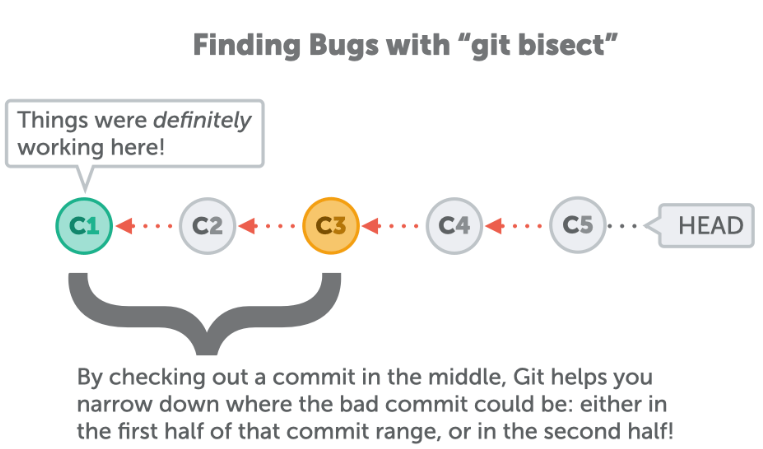

# [Git bisect tutorial](./assets/guides/git_bisect.pdf)

## *See PDF: [git_bisect.pdf](./assets/guides/git_bisect.pdf) (website above exported as PDF on the 21th July 2021)*

Useful when we want to find a commit that created a bug.
Simply put, we specify the last commit we remember where we are sure there were no bugs. Git will then check commit by commit, between the good and bad commits we specified. The searching starts in the middle. This searching processes is recursive, and is applied until we've successfully singled out the bad commit.



When we've identified the erroneous commit, we use:  
```git bisect reset```
to finish the bisect.
