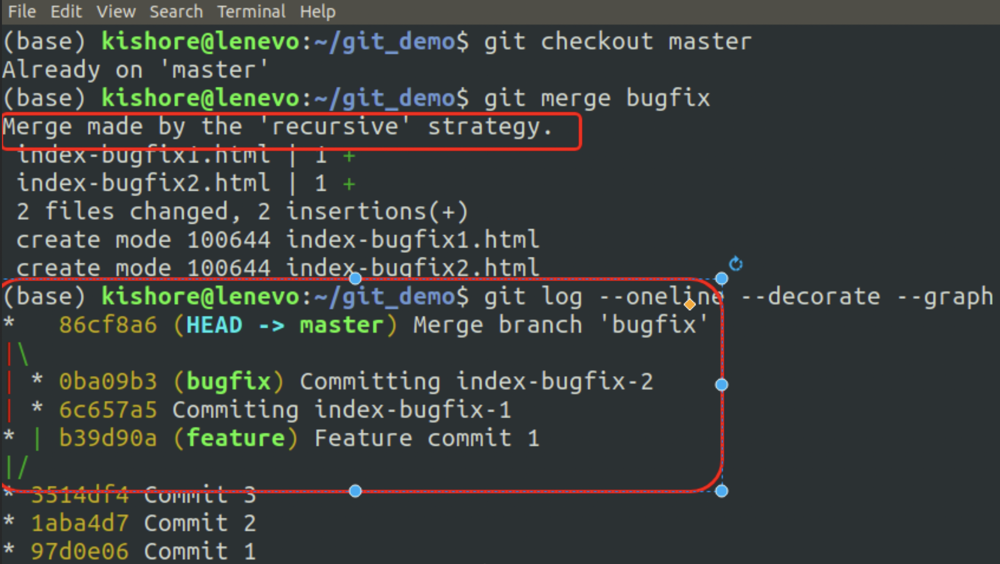
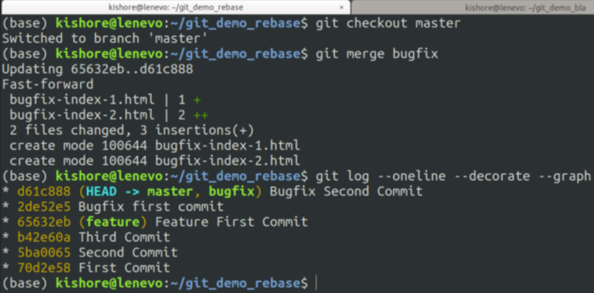

# Practical example: [git merge vs rebase — Which one to use When](https://krishnakishorev.medium.com/git-merge-vs-rebase-which-one-to-use-when-4a05eaef8e47)

## *See PDF: [git merge vs rebase — Which one to use When by KRISHNA KISHORE V.pdf](./assets/guides/git_merge_vs_rebase_which_one.pdf) (website above exported as PDF on the 21th July 2021)*

**Sum up:**  
Complete tutorial about git merge and rebase. Gives a practical example.

In the example, we create a bugfix branch from master. At the same time another developer, creates a feature branch from master and merges into master. Finally, we must add the changes of bugfix to master, with the updates of the feature branch. This can be accomplished in two ways.

The 1st way is to do a git merge. In this case, git looks for the common ancestor commit and adds the commits of both branches on top of the ancestor. Finally, it creates a new commit to represent the merge.
This is possible to do, but the git log history will not look that clean.

The 2nd way is to rebase master into bugfix and then merge bugfix into master. In this case, git looks once again at the most recent common ancestor commit. Finally, it applies all the commits of master in bugfix. This results in a linear git log history, because the commits were literally applied into the bugfix branch. Like they were done in the bugfix branch directly.
Finally, merging bugfix into master, will result in a fast-forward merging strategy, because the HEAD is simply moved to the last commit of bugfix. The other master commits were already rebased into bugfix.

